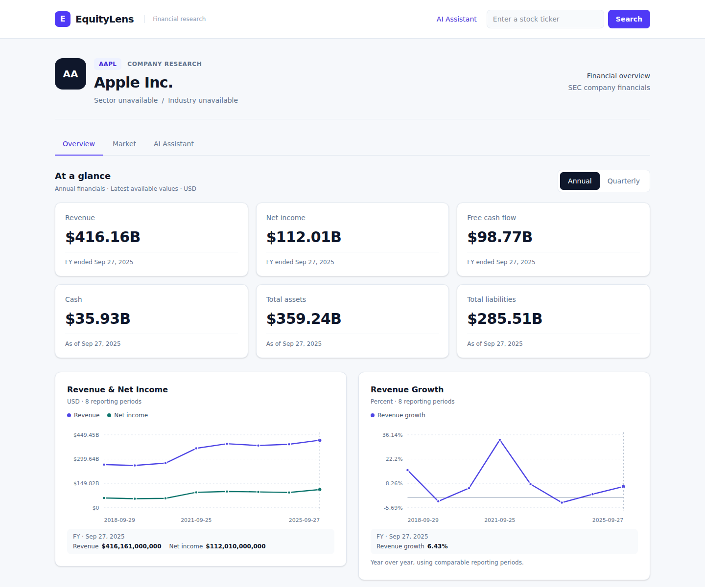
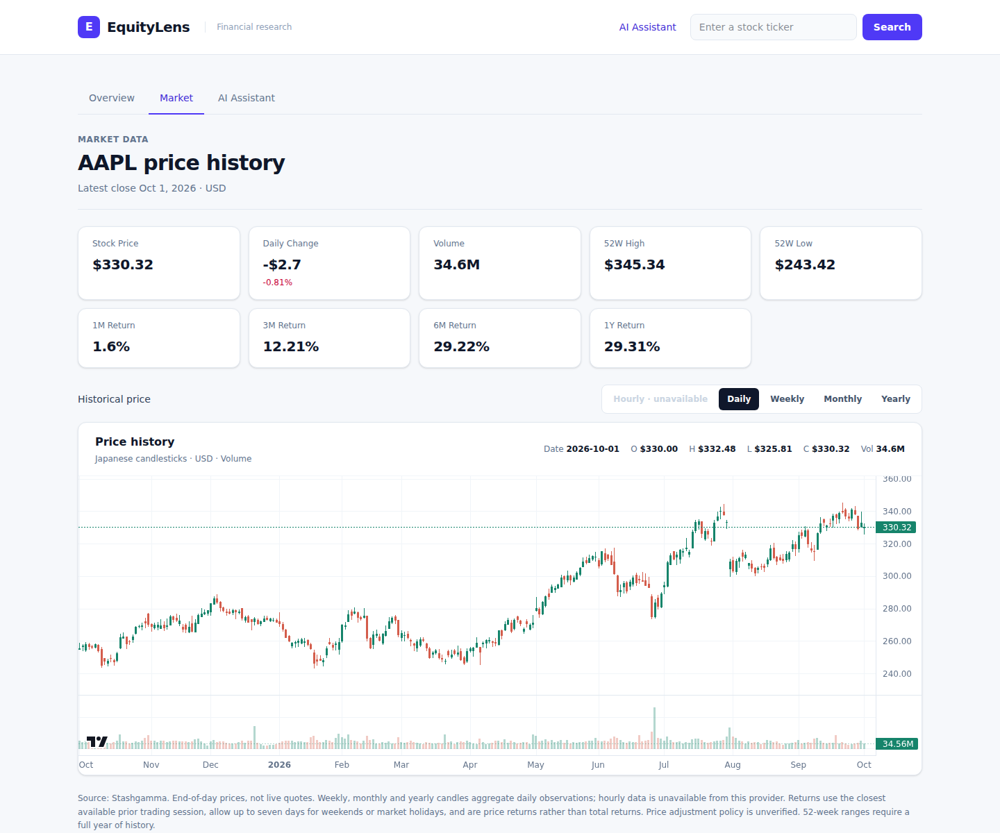
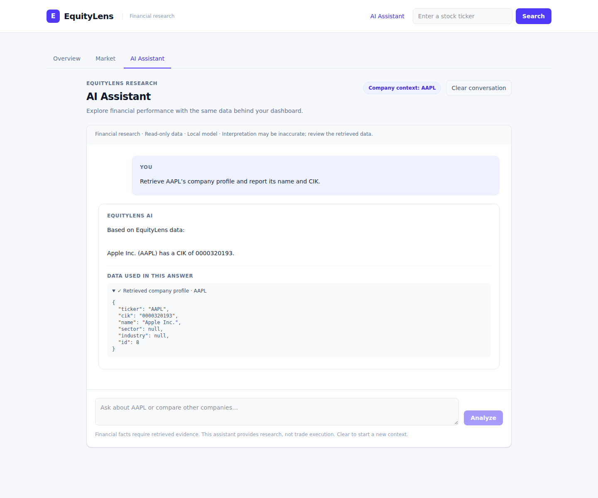
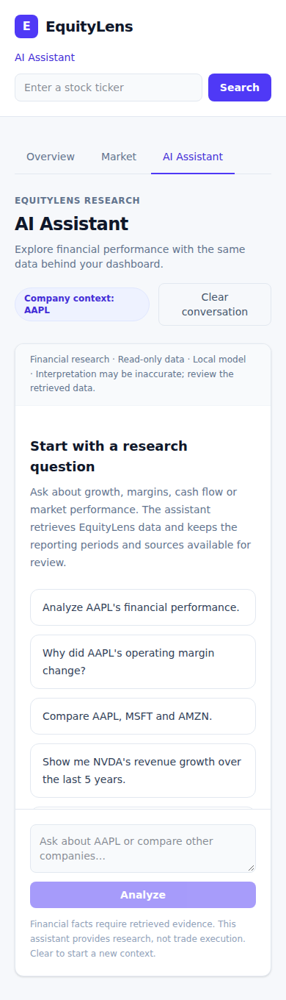
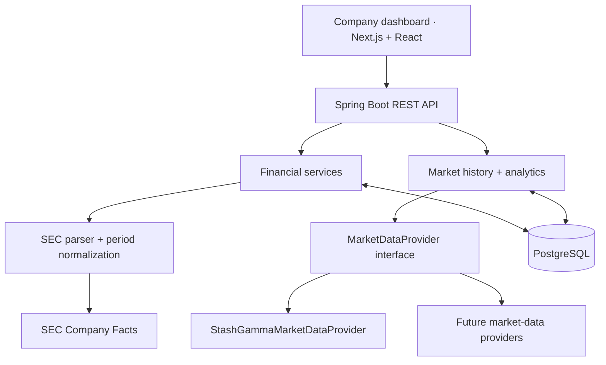

<div align="center">

# EquityLens

### Company research, grounded in the numbers.

Explore SEC financial statements, understand business performance, and put daily stock prices in context.

**Overview · Market · AI research preview**


[Screenshots](#screenshots) · [Explore the features](#what-you-can-explore) · [Research examples](#research-examples) · [Run locally](#run-locally) · [Architecture](#architecture) · [Data principles](#data-principles)

</div>

---

EquityLens brings company fundamentals and market history into one research workspace. The backend handles importing, normalizing, storing, and calculating financial data. The frontend makes those results easy to explore.

> **Development status:** The ticker-driven financial dashboard and StashGamma market layer are implemented and tested. EquityLens is under active development; public market-data display requires the provider authorization described below.

## Screenshots

Real captures of the running EquityLens application, using AAPL as an example. Financial observations and market values reflect the data available when captured; these images are examples, not live quotes.

### Financial overview

Company identity, annual/quarterly financial KPIs, reporting trends and statements in one workspace.



### Market research

Daily closing prices, OHLCV candlesticks, volume, price returns and data-source information. Use the interval controls to explore daily, weekly, monthly and yearly history.



### AI Assistant — local development preview

A real local-model response backed by the `get_company` MCP tool, with the retrieved company profile expanded for inspection. The assistant is being developed locally; **its implementation is not part of this documentation-only publication**. The financial dashboard and Market screenshots show the existing application.



<details>
<summary>See the assistant on mobile</summary>



</details>

## What you can explore

| Financial performance | Daily market data |
| :--- | :--- |
| Ticker-driven company research | Latest available daily closing price |
| Annual and quarterly reporting views | Interactive Japanese candlestick and volume chart |
| Revenue, net income, and revenue growth | 52-week high and low |
| Gross, operating, and net margins | 1-month, 3-month, 6-month, and 1-year price returns |
| Operating cash flow, CapEx, and free cash flow | Cached prices with source and freshness information |
| Cash, debt, assets, and liabilities | Explicit unavailable and stale-data states |

Financial charts share the reporting periods used by the statement table. The Market section is independent of the annual/quarterly selector. Existing trailing-twelve-month calculations remain in the backend.
Company research is split into Overview and Market tabs. Market history supports daily bars and backend-aggregated weekly/monthly/yearly bars; hourly bars are shown as unavailable while the selected provider lacks intraday data.

## Research examples

| Research question | Where to explore |
| :--- | :--- |
| How have AAPL's revenue and net income changed? | Overview → annual or quarterly trends |
| Did operating margin improve alongside revenue growth? | Overview → profitability and growth charts |
| What happened to AMZN's free cash flow? | Overview → cash flow and financial statements |
| How did NVDA's price perform over the past year? | Market → price history and period returns |
| Which filing periods support a financial trend? | Overview → reporting dates in the statement table |

The local AI preview adds natural-language questions such as **“Why did margins fall?”**, **“Compare AAPL, MSFT and AMZN”**, and **“Show NVDA's revenue growth over the last five years.”** Company context is passed explicitly, and retrieved evidence remains inspectable. Model interpretation should be checked against that evidence.

## Architecture



- **Financial data:** SEC Company Facts → existing importer → normalized observations → statements and TTM calculations.
- **Market data:** replaceable daily-price provider → persisted OHLCV observations → backend analytics → Market API.
- **Presentation:** Next.js fetches backend responses on the server. Provider credentials stay in the backend.

The historical-price integration is separate from the existing Finnhub quote integration. SEC services do not fetch stock prices.

## Run locally

### Prerequisites

- Java **21**
- Node.js **24** recommended, with npm
- Docker with Docker Compose
- A free [StashGamma API key](https://www.stashgamma.com/developer-docs) for market prices

The Gradle wrapper is included; no separate Gradle installation is needed.

### 1. Clone and start PostgreSQL

```bash
git clone https://github.com/sndpkumar0184/equitylens.git
cd equitylens
docker compose up -d postgres
```

The development database runs on `localhost:5432`. Its name, username, and development password are configured in `docker-compose.yml` and `backend/src/main/resources/application.properties`.

### 2. Start the backend

```bash
cd backend
export SEC_USER_AGENT="EquityLens your-email@example.com"
read -rsp "StashGamma API key: " STASHGAMMA_API_KEY
export STASHGAMMA_API_KEY
./gradlew bootRun
```

The API runs at **http://localhost:8080**. Hibernate and the idempotent SQL initialization scripts apply the development schema updates at startup.

The market key is optional for starting the application. Without it, the financial dashboard still works and market values are unavailable. Never commit API keys or put them in `NEXT_PUBLIC_*` variables.

### 3. Start the frontend

In a second terminal:

```bash
cd equitylens/frontend
npm ci
BACKEND_URL=http://localhost:8080 npm run dev
```

Open **http://localhost:3000** and search for a ticker, or visit `/company/META`, `/company/AAPL`, or `/company/AMZN`.

The first request may take longer while SEC financials or daily prices are imported. Later requests reuse persisted data.

### Configuration

| Variable | Purpose | Default |
| :--- | :--- | :--- |
| `SEC_USER_AGENT` | Identifies SEC requests with a real contact address | Development placeholder |
| `STASHGAMMA_API_KEY` | Authenticates daily-price requests | Unconfigured |
| `MARKET_DATA_PROVIDER` | Selects historical market-price provider | `stashgamma` |
| `BACKEND_URL` | Backend address used by Next.js server requests | `http://localhost:8080` |
| `FINNHUB_API_KEY` | Existing optional Finnhub quote integration | Unconfigured |

## API examples

```bash
# Consolidated financial dashboard
curl http://localhost:8080/api/companies/AAPL/dashboard

# Daily prices and market analytics
curl http://localhost:8080/api/companies/AAPL/market

# Backend-aggregated monthly candlesticks
curl 'http://localhost:8080/api/companies/AAPL/market?interval=MONTHLY'

# Limit the chart history; summary metrics still describe the latest available session
curl 'http://localhost:8080/api/companies/AAPL/market?from=2026-01-01&to=2026-06-30'

# Existing normalized SEC observations and TTM financials
curl http://localhost:8080/api/companies/AAPL/financials/normalized
curl http://localhost:8080/api/companies/AAPL/financials/ttm
```

`GET /api/companies/{ticker}/market` returns company identity, source, freshness status, latest close/date, 52-week extremes, four price returns, and daily OHLCV history. Historical bounds use ISO dates and cannot extend into the future or beyond the supported 15-year window.

## Data principles

**Keep periods comparable.** Annual, quarterly, year-to-date, and trailing-year observations are distinguished. Balance-sheet values retain their reporting dates.

**Keep missing values missing.** Unsupported SEC tags, incomplete debt components, insufficient price history, and provider failures produce unavailable values rather than invented zeros.

**Calculate in the backend.** Margins, growth, cash flow, TTM values, and market returns are computed before data reaches the UI.

**Make market semantics visible.** The latest stock price is a daily close, not a live quote. Returns compare provider closes with the latest available observation on or before the calendar target, within seven days. They exclude dividend reinvestment. StashGamma's documented API does not establish split/dividend adjustment semantics, so adjusted close is left unavailable.

**Cache responsibly.** Successful market imports are reused for six hours when coverage is sufficient. Empty results and failures also have retry windows. Corrected observations are upserted; unsuccessful refreshes preserve cached prices. No scheduled refresh job runs in this iteration.

## Checks and production build

PostgreSQL must be running for backend integration tests. Test data changes are rolled back.

```bash
cd backend
./gradlew test build
```

```bash
cd frontend
npm run lint
npm test
npm run build -- --webpack
npm exec tsc -- --noEmit
BACKEND_URL=http://localhost:8080 npm run start
```

The webpack option is useful in restricted environments where Turbopack cannot bind its local worker ports. Both builds use the existing Next.js application.

## Repository map

```text
equitylens/
├── backend/
│   ├── src/main/java/com/equitylens/
│   │   ├── controller/     REST endpoints
│   │   ├── dto/            API and normalized data contracts
│   │   ├── entity/         Persisted companies, financials, and prices
│   │   ├── providers/      Market-data adapters
│   │   ├── repository/     Database access
│   │   ├── sec/            SEC parsing and observation rules
│   │   └── service/        Imports, normalization, and calculations
│   ├── src/main/resources/db/
│   └── src/test/
├── frontend/
│   ├── app/                Routes and server-side data loading
│   ├── components/         Dashboard, charts, tables, and search
│   └── lib/                API clients, types, and formatting
├── docs/                   Implementation notes
└── docker-compose.yml      Local PostgreSQL
```

## Sources and public deployment

- [SEC EDGAR APIs](https://www.sec.gov/search-filings/edgar-application-programming-interfaces) supply company financial observations.
- [StashGamma Developer API](https://www.stashgamma.com/developer-docs) supplies daily market prices. Its free tier currently lists 300 requests/hour, 800/day, and 4,000/week.
- **Free API access does not establish public redistribution rights.** StashGamma's [terms](https://www.stashgamma.com/terms) require permission for distribution and written permission for commercial use. Obtain the appropriate authorization before publishing its data to public users.

EquityLens is under active development. The local database credentials and automatic schema updates are development defaults. No investment advice is provided.

## MCP and local AI research assistant

The screenshots above preview the local AI implementation: a read-only MCP interface inside the existing Spring Boot backend and a configurable Ollama provider. The assistant retrieves company information, financial metrics and market history through existing EquityLens services. It shares the existing PostgreSQL data and financial calculations with the dashboard.

Overview and Market continue to use REST; normal dashboard requests do not depend on MCP. The model has no arbitrary SQL, filesystem or trade-execution tools. Unsupported hourly candles and missing metrics remain explicitly unavailable.

This preview is not yet included in the published application code. Its local implementation and tests remain separate from this README/screenshots update. No paid cloud API is required; a compatible local model/runtime is needed for the assistant.
