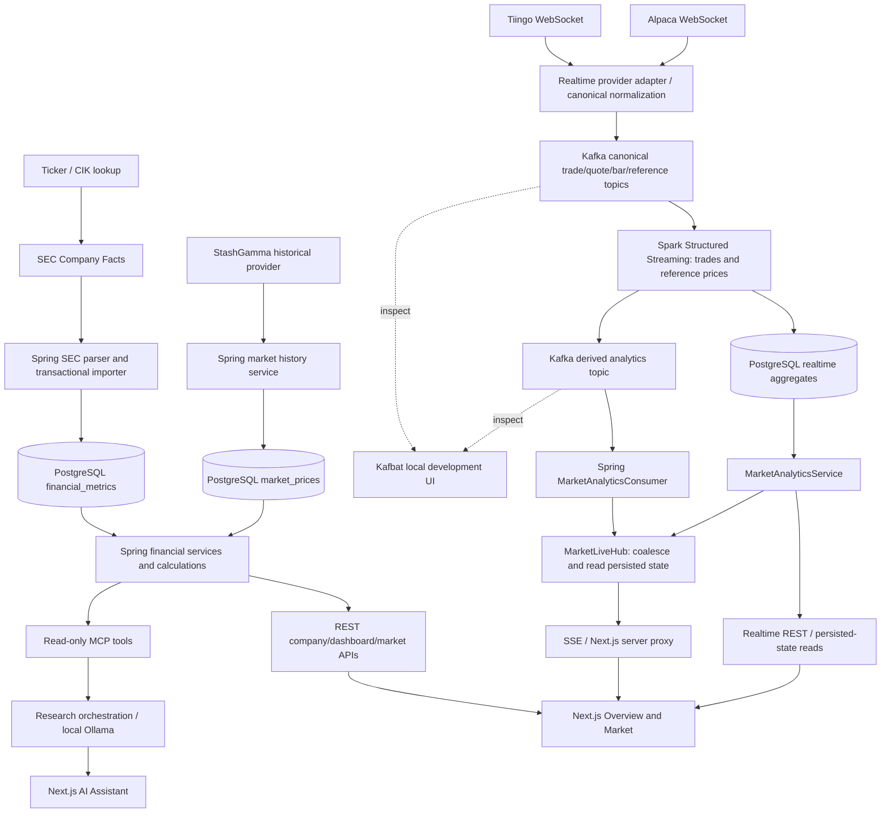

# EquityLens

EquityLens is an actively evolving financial research and analytics platform that brings together SEC financial data, historical market data, interactive dashboards, and tool-based research. The project emphasizes reliable data foundations and clear separation between ingestion, calculations, APIs, and presentation.

## Overview

Explore company fundamentals over time, compare financial performance with historical prices, and investigate questions through a local AI research assistant. The dashboard uses REST APIs; the assistant uses a separate, controlled MCP interface to the same services and database.

## Key Capabilities

- **SEC financial ingestion:** resolve company tickers and CIKs, retrieve Company Facts, and normalize annual and quarterly financial observations.
- **Financial analytics:** historical revenue, cash flow, balance sheet metrics, growth, margins, and existing valuation calculations.
- **Company dashboards:** searchable companies, financial charts, statement views, and company-specific navigation.
- **Historical market analysis:** provider-agnostic retrieval and caching, daily/monthly/yearly price views, OHLC candles, and market summaries. Hourly history is explicitly unsupported by the current historical provider.
- **Research assistant:** ten read-only MCP tools, explicit company context, local Ollama integration, and expandable data evidence. A running tool-capable model is required.
- **Streaming subsystem — under development:** optional Alpaca/Tiingo adapters, canonical Kafka events, Spark trade aggregation, PostgreSQL analytics, and live dashboard updates. These components exist in the repository; production operation and live-provider validation remain ongoing work.

## Architecture



There are three independent data paths:

| Request/data | Actual processing | Kafka / Spark dependency |
| --- | --- | --- |
| `/api/companies/{ticker}/dashboard` | `DashboardController` → `DashboardService` → `CompanyService` / `FinancialDataService` → PostgreSQL → financial normalization/calculations | None. Missing/outdated SEC imports are fetched, parsed and persisted synchronously before returning. |
| `/api/companies/{ticker}/market` | `MarketHistoryController` → `MarketHistoryService` → `MarketDataProvider` / StashGamma → PostgreSQL price cache | None. Historical prices remain separate from realtime events. |
| Realtime provider events | `RealTimeConfiguration` → provider adapter → `CanonicalKafkaPublisher` → Kafka → `streaming/job.py` → PostgreSQL aggregates / derived Kafka notifications | Required for new realtime analytics, not for ordinary financial reads. |
| `/api/market/realtime/{symbol}` | `MarketRealtimeController` → `MarketAnalyticsService` → `MarketAnalyticsRepository` → PostgreSQL | Reads durable state; does not query Kafka or trigger ingestion. |

For AMZN, a complete cached SEC import is read directly from `financial_metrics`.
Requesting its dashboard does **not** produce a Kafka event or submit a Spark job.
The LLM interprets service/tool results; deterministic financial and streaming
calculations stay in Spring and Spark.

The optional realtime subsystem uses Kafka 4.0.2 in single-node KRaft mode and
Spark 4.0.3 with the Kafka SQL connector. Local Spark uses `local[2]`, four shuffle
partitions and five-second triggers. It is not a distributed production cluster.

| Kafka topic | Producer | Consumer / result |
| --- | --- | --- |
| `equitylens.market.trade.v1` | Canonical provider adapter or explicit synthetic replay | Spark validation, one-/five-minute trade OHLCV and rolling analytics |
| `equitylens.market.quote.v1` | Canonical provider adapter | Retained transport; no processing consumer implemented |
| `equitylens.market.bar.v1` | Canonical provider adapter | Retained transport; no processing consumer implemented |
| `equitylens.market.reference.v1` | Canonical provider adapter | Spark latest reference state |
| `equitylens.analytics.market.v1` | Spark sink | Spring notifications; persisted state is delivered through SSE |

Topics default to four partitions, replication factor one and 24-hour retention.
Keys are normalized symbols. Ordering is per partition, not global. Version-1
JSON events preserve event ID/time, receipt time, provider/feed and typed data;
raw provider protocols and credentials are not application payloads.

Spark uses a two-minute event-time watermark and bounded event-ID deduplication.
Finalized trade windows produce OHLCV and VWAP (`Σ price×quantity / Σ quantity`).
Rolling metrics include one-/five-minute percentage returns, five-minute volume
and VWAP, sample volatility of five consecutive log returns, and current-minute
volume divided by the previous 20-minute mean. A ratio of at least three marks
unusual volume. Incomplete histories return null metrics; feeds are not merged.

Durable tables are `realtime_market_bar`, `realtime_market_analytics`, and
`realtime_reference_state`. Source/feed/synthetic identity and deterministic
window keys support idempotent upserts. Raw ticks are retained in Kafka rather
than written to these tables. PostgreSQL commits and derived Kafka publication
are not atomic; retries can duplicate notifications without duplicating rows.
Separate checkpoint directories under `SPARK_CHECKPOINT_ROOT` preserve source
progress and state. Failed sinks require operational recovery/restart; no claim
of end-to-end exactly-once delivery is made.

Live-provider validation remains ongoing. The verified development workload was
explicitly synthetic; running containers and passing fixture tests do not prove
an entitled Alpaca/Tiingo feed is active. The implementation described here is
in the development working tree; documentation publication does not imply that
all parallel application changes have been committed.

## Technology Stack

| Area | Technologies |
| --- | --- |
| Backend | Java 21, Spring Boot 4, Gradle, Spring MVC, JPA |
| Storage | PostgreSQL 17 |
| Frontend | Next.js 16, React 19, TypeScript, Tailwind CSS, Lightweight Charts |
| Data | SEC EDGAR Company Facts, market provider abstraction, StashGamma historical integration |
| Optional streaming | Kafka 4, Spark 4 Structured Streaming, Python, Alpaca/Tiingo adapters |
| Research | Official MCP Java SDK, provider abstraction, local Ollama tool calling |
| Testing | JUnit/Spring Boot tests, Vitest, React Testing Library, Python unittest |

## Engineering Focus

The project separates provider integrations from application services, centralizes financial normalization and calculations, and uses bounded API responses with explicit missing-data states. Tests cover financial behavior, market capabilities, tool validation, and UI interactions. Streaming work explores event identity, late data, durable checkpoints, and replay-safe storage. AI access is limited to defined tools rather than unrestricted database or filesystem access.

## Current Status

EquityLens is actively evolving. New capabilities and architectural improvements are added as the data platform and research experience develop.

| Area | Status |
| --- | --- |
| SEC ingestion and financial dashboards | Implemented |
| Historical market dashboard and provider abstraction | Implemented; requires provider credentials |
| MCP tools and assistant UI | Implemented |
| Local LLM integration | Implemented; requires an installed runtime/model |
| Kafka ingestion and Spark analytics | Under development; optional implementation present |
| Live-provider and production streaming validation | In progress |

## Screenshots

These are captures of the application, not mockups. Data and available features depend on the configured providers and runtime.

### Financial overview


### Historical market dashboard


### Company research assistant


<details>
<summary>Mobile assistant view</summary>


</details>

Example research questions include “Analyze AAPL's financial performance,” “Compare AAPL and NVDA,” and “What happened to AMZN's free cash flow?” Answers depend on available EquityLens data and local model capabilities.

## Local Development

Prerequisites: Java 21, Node.js with npm, Docker Compose, and PostgreSQL. Ollama is optional for research; Kafka/Spark are optional for streaming.

```bash
cp .env.example .env
# Fill in local configuration; never commit .env.
docker compose up -d postgres
```

In separate terminals, from the repository root:

```bash
set -a
source .env
set +a
cd backend
./gradlew bootRun
```

```bash
cd frontend
cp .env.example .env.local
npm ci
npm run dev
```

Open http://localhost:3000. See [development setup](docs/development.md), [assistant configuration](docs/ai-assistant.md), and [optional streaming setup](docs/streaming.md). Provider credentials remain on the server.

## Verify every stage locally

Start PostgreSQL and the backend first so its realtime schema is initialized.
Configure `.env` and `.env.realtime` with your existing local database settings;
never commit credentials. The realtime file is a Compose env file and must not
be sourced as shell code (some values contain spaces).

```bash
# From the repository root, after configuring environment files:
docker compose --env-file .env --env-file .env.realtime \
  -f docker-compose.yml -f docker-compose.realtime.yml config --quiet
docker compose --env-file .env --env-file .env.realtime \
  -f docker-compose.yml -f docker-compose.realtime.yml up -d
docker compose -f docker-compose.yml -f docker-compose.realtime.yml ps
```

Export backend provider settings separately before starting Java. For live data,
set `REALTIME_ENABLED=true`, `REALTIME_LIVE_ENABLED=true`, an explicit symbol list,
provider credentials and matching analytics provider/feed. Do not place secrets
in `NEXT_PUBLIC_` variables. Use `bash scripts/run-backend.sh --server.port=8080`
for an immutable executable-JAR copy, or the existing `./gradlew bootRun` workflow.
In a separate frontend terminal, use
`BACKEND_URL=http://127.0.0.1:8080 npm run dev -- --port 3000`.

| Stage | Check | Evidence of success |
| --- | --- | --- |
| Infrastructure | Compose `ps` | Kafka healthy; PostgreSQL, Spark and Kafbat running |
| Provider | `GET /api/market/realtime/AMZN` → `ingestion` | `LIVE`, increasing received/normalized counts; no publish failures. `DISABLED` means ingestion is off. |
| Kafka input | Kafbat → Topics → trade/reference topic → Messages | New canonical events, symbol key, actual provider/feed and event timestamp |
| Partitioning | Kafbat → topic → Partitions | Partition IDs, leaders, beginning/end offsets and in-sync replicas |
| Spark | http://localhost:4040 → Structured Streaming | Running queries and new input batches/jobs when new events arrive |
| Durable bars | Query `realtime_market_bar` | Finalized one-/five-minute OHLCV with matching source/feed |
| Durable metrics | Query `realtime_market_analytics` | Rolling statistics; nulls are expected during warmup or gaps |
| Derived Kafka output | Kafbat → `equitylens.analytics.market.v1` | Versioned `MARKET_ANALYTICS` events after persistence |
| Spring notifications | Kafbat → Consumers | Active `equitylens-live-<instance-id>` groups approach topic end offsets |
| REST | `/api/market/realtime/AMZN` | Matching persisted `bar`, `analytics`, provider/feed and timestamps |
| SSE | `/api/market/realtime/AMZN/events` | `market` events on derived changes and heartbeat comments |
| Browser | `/company/AMZN/market` | Historical prices plus realtime state/source labels and explicit synthetic/stale states |
| Independent financial path | `/api/companies/AMZN/dashboard` | Actual annual/quarterly financial metrics even when realtime ingestion is off |

### Kafka development UI

Open **http://localhost:8081** and select **EquityLens Local**. The official pinned
image is `ghcr.io/kafbat/kafka-ui:v1.5.0`. Kafbat uses Docker service address
`kafka:29092`; host clients use `localhost:9092`. It is loopback-only, read-only,
preconfigured on restart, and independent of the customer-facing Next.js UI.
No application service depends on this observer.

Select **Topics → equitylens.market.trade.v1 → Partitions**, then **Messages**.
Choose partitions and earliest/latest/offset seek, expand a record, and inspect
its key and JSON value. Confirm `key = symbol`, `schemaVersion = 1`,
`eventType = TRADE`, `data.price`, `data.quantity`, and source `provider` / `feed`.
Synthetic events must say `SYNTHETIC`; they are not evidence of live provider data.
Empty quote/bar/reference topics are legitimate when the provider does not emit
them. End offsets are next-record positions, not retained-message counts.
Expired records cannot be browsed after retention.

Kafbat shows conventional Spring group offsets/lag. Spark Structured Streaming
uses durable checkpoint offsets instead of conventional committed group offsets;
do not invent a Spark group or interpret a missing group as disconnection.
Use Spark's **Structured Streaming** tab, progress logs and checkpoint state.
A caught-up query can remain running with no new jobs. Event-time windows need
watermark advancement, not arbitrary sleeps, before final results appear.

### Inspect persistence and API output

```bash
docker compose exec postgres sh -lc \
  'psql -U "$POSTGRES_USER" -d "$POSTGRES_DB"'
```

```sql
SELECT symbol, provider, feed, synthetic, interval, window_start,
       open, high, low, close, volume, vwap
FROM realtime_market_bar
WHERE symbol = 'AMZN'
ORDER BY window_start DESC LIMIT 10;

SELECT symbol, provider, feed, synthetic, window_start,
       return_1m_pct, return_5m_pct, rolling_volume, rolling_vwap,
       volatility_pct, volume_ratio, anomaly
FROM realtime_market_analytics
WHERE symbol = 'AMZN'
ORDER BY window_start DESC LIMIT 10;

SELECT * FROM realtime_reference_state WHERE symbol = 'AMZN';
```

```bash
curl -fsS http://localhost:8080/api/companies/AMZN/dashboard | python3 -m json.tool
curl -fsS http://localhost:8080/api/market/realtime/AMZN | python3 -m json.tool
curl -N http://localhost:8080/api/market/realtime/AMZN/events
docker compose -f docker-compose.yml -f docker-compose.realtime.yml logs --tail=100 spark
```

Repeat company/dashboard/market checks for META, AAPL and NVDA. An unknown ticker
should return 404. A connected SSE session proves browser/backend connectivity,
not provider activity. Latest realtime reads filter by configured source and a
recent time range; older database rows can exist while the API reports `NO_DATA`.

### Verify without live markets

Only in an explicitly synthetic development configuration, set Spark
`STREAMING_ALLOW_SYNTHETIC=true` and select `SYNTHETIC` / `FIXTURE` with
`REALTIME_ANALYTICS_SYNTHETIC=true` for backend analytics reads. Restart the
configured components to apply environment changes, then:

```bash
docker compose -f docker-compose.yml -f docker-compose.realtime.yml exec -T spark \
  python3 /opt/equitylens/replay.py --allow-synthetic --current-time
```

This publishes the existing canonical fixture with explicit synthetic metadata,
preserving relative ordering and duplicate scenarios. Check Kafka, Spark batches,
PostgreSQL and REST in that order. Never use this configuration as live-market
financial evidence or mix its identity with real-provider aggregates.

## Testing

```bash
cd backend
./gradlew test --rerun-tasks build
```

```bash
cd frontend
npm run lint
npm test
npm exec tsc -- --noEmit
npm run build -- --webpack
```

Current execution results and environment limitations are recorded in [verification](docs/verification.md). Historical subsystem checks remain documented separately and do not imply that every current integration has been verified live.

## Roadmap

- Validate streaming adapters against entitled live feeds and exercise recovery scenarios.
- Extend operational monitoring, deployment authentication, and production infrastructure configuration.
- Improve financial source lineage and research answer quality.
- Expand market-provider capabilities while preserving the existing service interface.

See [contributing](CONTRIBUTING.md), [financial data behavior](docs/ticker-driven-companies.md), and [historical market design](docs/market-data-verification.md).
