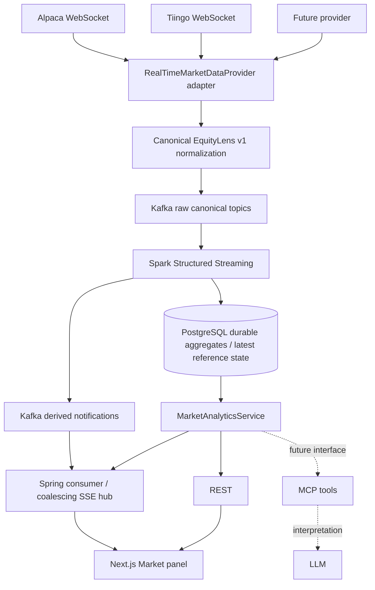

# Real-time market intelligence implementation

This subsystem is additive. SEC financial data, historical MarketDataProvider imports, existing financial calculations, dashboard REST routes, and MCP/assistant code retain their existing roles. Realtime ingestion defaults off. Spark runs separately from the Spring HTTP server.



## Existing architecture and coexistence

Backend: Spring Boot 4.1.1, Java 21, Gradle 9.5.1, JPA/JDBC, PostgreSQL 17. Existing historical providers are StashGamma and Finnhub; MarketDataProvider already documents historical behavior and is left unchanged. MarketHistoryService caches durable historical prices/import freshness in PostgreSQL and aggregates daily history for larger intervals. Historical charts use lightweight-charts. Frontend: Next.js 16.3.2, React 19.2.8, TypeScript, Vitest and existing server-side API proxies. No existing market SSE/Kafka/Spark infrastructure was required by the historical dashboard.

Starting tracked diff was saved to `/tmp/equitylens-pre-realtime.diff`. Existing uncommitted ai/, mcp/, their tests, assistant routes/components, company service changes, layout/tabs, dependency additions and configuration were preserved. Further documentation/environment edits appeared concurrently; this task does not revert them. No commit, reset, or removal of unrelated work is performed. The service is reusable by future MCP tools; no realtime MCP tool registration is added.

## Provider boundary

RealTimeMarketDataProvider has capabilities(), connect(eventSink), disconnect(), subscribe(symbols, channels), unsubscribe(symbols), status() and close(). Typed event delivery replaces separate streamTrades/streamQuotes methods; requested capabilities select channels. Provider-specific JSON stays inside adapters. Capability values: TRADES, QUOTES, BARS, NEWS, REFERENCE_PRICE. Unsupported channel subscriptions throw rather than fabricate values.

Alpaca uses configurable secure v2/feed WebSocket endpoints, JSON authentication, channel subscriptions, and arrays of stock trade/quote/minute-bar messages. ALPACA_CHANNELS describes the channels configured for the feed; entitlement is verified by provider authentication and subscription responses. Preserve feed, exchange, quote bid/ask exchange, conditions and tape. Quote sizes remain round lots, explicitly labeled ROUND_LOTS. Trade quantities are shares. There is no assumption that IEX is consolidated US coverage.

Tiingo uses its IEX WebSocket protocol: authorization token and eventData thresholdLevel/tickers/subscriptionId. Threshold 6 (default) is reference-only; 0 provides TOPS trades/quotes subject to exchange agreement; 5 is filtered and identified as IEX_TOPS_FILTERED. Reference-price arrays and TOPS arrays have different positions and are parsed separately. Reference updates never become trades. Quote sizes are shares. Subscription updates replace desired tickers using subscriptionId. Empty desired subscriptions, plan limits and provider rejections remain subject to provider behavior; do not use a firehose wildcard.

Both adapters validate secure URLs and symbol/subscription limits, limit text frames to 1 MiB, use explicit WebSocket demand, reconnect with exponential delay capped at 60 seconds, count malformed/errors/unsupported messages, discard stale connection callbacks and close gracefully. A 60-second no-message watchdog reconnects quiet/stalled streams; quiet closed-market Alpaca streams may reconnect periodically. Credentials/URLs are deployment configuration and cannot be supplied through REST.

One active provider is selected per backend instance. Run only one ingestion instance per feed unless coordinated externally. Future failover can swap adapters without changing canonical consumers, tables or APIs, but needs entitlement-aware health checks, source transition reporting, and explicit feed selection. Do not sum overlapping sources. Source/feed/synthetic identity remains separate in all Spark groups and database keys.

## Canonical JSON contract and evolution

No schema registry is added. Java records define v1; Spark has an explicit v1 JSON schema and rejects unknown versions. New optional fields may be added within v1. Breaking changes need v2 topics, parser updates and a fresh compatible checkpoint. Prices/quantities are JSON numbers, represented with BigDecimal in Java and decimal types in Spark. Examples and raw/derived JSON Schemas live in streaming/schemas/. Decimal persistence rounds prices/VWAP/returns to 10 fractional digits; shares to 6; notional to 16. Explicit intermediate casts prevent Spark division from unexpectedly reducing VWAP to 6 decimals. This is financial observation analytics, not execution/accounting precision guarantees for arbitrary instruments.

Common fields: schemaVersion=1, eventId, eventType, normalized symbol, UTC eventTime, UTC receivedAt, provider, feed, nullable exchange, sourceMetadata, data. Java canonical timestamps use nine fractional digits. Event IDs derive from provider/feed/type/symbol/timestamp and source identity/payload; receivedAt is excluded so redelivery keeps identity. Alpaca trade IDs retain exchange/time/price/size context; Tiingo lacks a universal exchange trade ID, so identical payload fingerprints may collapse genuinely identical trades. This limitation prevents claiming perfect tick-level reconciliation.

TRADE data: price > 0, quantity > 0 (shares). QUOTE: optional bidPrice/bidSize/askPrice/askSize, sizeUnit, bidExchange, askExchange; missing sides stay null. BAR: interval=1m, open/high/low/close, volume, optional vwap. REFERENCE_PRICE: price only. sourceMetadata carries conditions/tape/threshold/nanoseconds/flags where available; synthetic fixture events require synthetic=true and provider=SYNTHETIC. Malformed messages are counted without logging payloads.

Spark consumes trade and reference topics only. Quote/bar canonical events are retained for future jobs, not added to trades (which would double count). Alpaca corrections/cancels and Tiingo breaks are counted as unsupported, not processed as volume; trade-derived bars are explicitly quality=OBSERVED_TRADES_UNCORRECTED. They include observed positive trades without exchange eligibility/correction rules and must not be represented as official corrected exchange OHLCV. Provider metadata survives as provider/feed/synthetic aggregate identity and quality; per-tick exchange/conditions remain in retained canonical events, not summarized as a single exchange for multi-exchange windows.

## Kafka

Pinned broker and Java client: Apache Kafka 4.0.2. Single combined KRaft broker/controller for development, no ZooKeeper. Four partitions by default (KAFKA_PARTITIONS), replication factor 1. Host listener localhost:9092 and container listener kafka:29092. Topics:

| Topic | Content / consumer |
|---|---|
| equitylens.market.trade.v1 | Canonical trades / Spark OHLCV |
| equitylens.market.quote.v1 | Canonical quotes / retained for future analytics |
| equitylens.market.bar.v1 | Provider bars / retained, not merged with trades |
| equitylens.market.reference.v1 | Canonical reference prices / Spark latest state |
| equitylens.analytics.market.v1 | Derived notifications / Spring SSE consumer |

No separate anomaly topic: anomaly flag is already in market analytics. All keys are symbols. Kafka orders records within a partition, not globally; provider reconnect and event timestamps can still be out of order. Increasing partitions changes future key placement and ordering across the transition; plan a controlled migration. Hot-symbol throughput is bounded by a partition. Raw retention defaults to 24 hours via KAFKA_RETENTION_MS=86400000 and broker KAFKA_RETENTION_HOURS=24. Topics use delete retention and Kafka is not permanent history. Changing an existing topic requires kafka-configs --alter; rerunning --create --if-not-exists does not change existing retention. E.g.:

```bash
docker compose -f docker-compose.yml -f docker-compose.realtime.yml exec kafka /opt/kafka/bin/kafka-configs.sh --bootstrap-server kafka:29092 --entity-type topics --entity-name equitylens.market.trade.v1 --alter --add-config retention.ms=172800000
```

Producer: symbol keys, acks=all, Kafka idempotence, bounded 8 MiB buffer, bounded block/delivery timeouts. WebSocket demand waits for publication. Failure increments counters, disconnects and reports possible DATA_GAP rather than buffering unboundedly. Provider WebSockets generally cannot replay outages, so this is not lossless ingestion. Spark outages are buffered by Kafka only within retention; offsets expired by retention fail loudly (failOnDataLoss=true).

## Spark execution, event time and checkpoints

Pinned Spark/PySpark 4.0.3, Scala 2.13 Kafka connector. Separate streaming/ application with Spark local[2] and four shuffle partitions in Docker. No provider APIs, credentials or HTTP serving in Spark. maxOffsetsPerTrigger=10000 bounds each microbatch; processing trigger defaults to 5 seconds. A validation query reports invalid/disallowed trade counts. Trade queries deduplicate provider/feed/synthetic/eventId within watermark and compute finalized tumbling UTC 1- and 5-minute bars. Reference query maintains one latest state per source/symbol and never creates VWAP/volume.

Watermark default 2 minutes (SPARK_WATERMARK); it is driven by maximum observed event time, not wall time. Events newer than watermark can arrive out of order. Finalized windows emit in append mode after watermark advancement. Older events are dropped by stateful operators and reported through Spark progress numRowsDroppedByWatermark. Duplicate count is visible in state-operator custom metrics. No-trade windows are absent, never zero-filled. Quiet streams do not finalize their last window until event time advances. A fast symbol/source advances the global query watermark; choose allowed lateness accordingly. Dedup state expires with watermark; a new checkpoint does not retain dedup state, and retained replay must include the full aggregation range.

Derived events distinguish analyticsKind=ROLLING_TRADE_METRICS or REFERENCE_STATE; notifications share one versioned topic.

Checkpoints are named /validation-v1, /1m-v1, /5m-v1, /reference-v1 under configurable SPARK_CHECKPOINT_ROOT, default /var/lib/equitylens/checkpoints on a named volume. Restart using the same checkpoint resumes offsets and state. Do not casually delete checkpoints. Incompatible query/state/schema changes need a NEW checkpoint directory and explicit retained replay; old state remains available. StartingOffsets=earliest applies only to new checkpoints. Replaying a historical fixture behind an existing watermark will correctly drop it; use a fresh development checkpoint for an independent replay. Do not run two jobs against one checkpoint. For production use reliable shared checkpoint storage and distributed Spark deployment.

## Formulas and missing data

All trade analytics are per symbol/provider/feed/synthetic, based on positive observed trade price p and quantity q, with UTC half-open windows [start,end).

| Metric | Formula / units / completeness |
|---|---|
| OHLC 1m / 5m | First/last event-time price; max/min price; event ID breaks equal-time ties. Not arrival order. |
| Volume | sum(q), shares; not quote sizes |
| VWAP | sum(p*q)/sum(q), USD; only actual trade quantities |
| 1-minute return | 100*(current 1m close / previous consecutive 1m close - 1), percent |
| 5-minute return | 100*(current 1m close / close 5 minutes earlier - 1), percent; six consecutive closes required |
| Rolling volume | Sum of last five consecutive finalized 1m volumes, shares |
| Rolling VWAP | Sum of trade notionals for those five bars / sum(volume), USD; not average of candle prices |
| Rolling volatility | 100 * sample stddev of last five consecutive 1m log(close_t/close_t-1) returns; percent, not annualized |
| Volume ratio | Current 1m volume / arithmetic mean of prior 20 consecutive 1m volumes; unitless |
| Volume anomaly | volumeRatio >= 3; transparent fixed statistical rule |

Warm-up or gaps yield null metrics; no forward fill or invented values. The volume baseline is short-term observed activity, not a seasonally adjusted/time-of-day baseline and not causal evidence. Non-price metrics remain null in reference-only feeds. Anomaly flag is false when the ratio is missing; callers should inspect volumeRatio before interpreting false as a computed result.

Window aggregation and rolling calculations use Spark expressions. foreachBatch reads at most 21 prior durable 1m bars per emitted minute using indexed lateral queries (including sparse multi-year replays) and uses Spark SQL windows to calculate rolling metrics; PostgreSQL handles storage only. Driver collection is bounded by maxOffsets and aggregate counts; this first local implementation is not intended for an unrestricted whole-market firehose.

## Durable schema and retry behavior

backend/src/main/resources/db/realtime-market-schema.sql follows existing idempotent startup SQL with ^^^ separators. No raw tick table or SEC duplication.

realtime_market_bar stores source-separated 1m/5m OHLCV, notional/VWAP, trade count, last event time and quality. Primary key: symbol/provider/feed/synthetic/interval/window_start. realtime_market_analytics stores rolling metrics/anomaly with symbol/provider/feed/synthetic/window_start key. Primary keys cover bounded latest/source queries; a partial recent-anomaly index covers anomaly=true. realtime_reference_state stores ONE latest reference observation per source/symbol, not a growing raw tick history; newer event-time/ID upserts prevent older reference events replacing newer state.

Bars and metrics upsert deterministic keys. Writes can be retried without duplicate rows. Bars commit before rolling-history reads/metric commit; a failed batch retries safely. PostgreSQL commit and derived Kafka send are NOT an atomic transaction: notification delivery is at least once, and failed sends fail the streaming query without committing its checkpoint batch. Restart resends deterministic IDs; the SSE hub coalesces notifications and reads PostgreSQL rather than blindly appending events. PostgreSQL data remains available if live notifications are down. There is no claim of end-to-end exactly-once across two sinks.

## Spring, REST, SSE and UI

MarketAnalyticsRepository encapsulates parameterized bounded SQL. MarketAnalyticsService exposes getLatestMarketState, getRecentBars, getRollingMetrics, getRecentAnomalies and separates configured source/feed/synthetic datasets. REST never queries Kafka and is available when ingestion is disabled. Default source follows configured provider; Tiingo feed follows threshold. Explicit REALTIME_ANALYTICS_* overrides support offline replay.

GET /api/market/realtime/{symbol}; subroutes /bars (interval=1m|5m), /analytics, /anomalies (rangeMinutes default60, limit default100); /events supplies SSE. rangeMinutes 1..10080, limit 1..500, symbol uses existing Ticker validation. Latest state is bounded to the past 24h of bars/metrics; reference state has its own event timestamp and UI staleness indicator.

Optional Spring consumer reads only fixed derived topic. Each HTTP instance gets its own consumer group (REALTIME_INSTANCE_ID); initial offset is latest because durable initial state is read from PostgreSQL. Derived notifications mark subscribed symbols dirty; a single scheduler coalesces state to at most one update per second per symbol. SSE connections cap at 200, heartbeat every15s and expire after5min; EventSource reconnects and receives a fresh state snapshot. DB/serialization errors close SSE and REST reports failure. Proxy/CDN deployments must disable response buffering and allow long-lived streams. SSE Connected indicates browser transport connectivity, not provider health; ingestion state and analytics age are separate labels.

Next.js server route proxies fixed backend routes, forwards cancellation for SSE, and keeps provider credentials and Kafka addresses server-side. MarketSection adds a RealtimeMarket panel alongside historical cards/charts. Shows derived price/reference price, returns, rolling volume/VWAP, volatility, volume ratio, source/feed, last event, stale/connection states and latest anomaly. Metrics are deterministic, not labeled AI. Historical chart behavior is covered separately by existing tests.

## Exact local commands

Run from ~/projects/equitylens. Use existing database credentials; placeholders below use the original development database. Configure root .env if your existing setup overrides these. First initialize tables:

```bash
docker compose up -d postgres
cd backend
./gradlew bootRun
```

In a second shell at the repository root:

```bash
docker compose -f docker-compose.yml -f docker-compose.realtime.yml up -d --build kafka kafka-topics spark
```

For live Alpaca, launch the backend with server-only credentials already exported (never put real values in committed files):

```bash
export REALTIME_ENABLED=true REALTIME_LIVE_ENABLED=true
export REALTIME_MARKET_PROVIDER=alpaca REALTIME_SYMBOLS=AAPL,META,AMZN,NVDA
export KAFKA_BOOTSTRAP_SERVERS=localhost:9092 ALPACA_FEED=iex
cd backend
./gradlew bootRun
```

For Tiingo, choose the entitled threshold; default6 supplies reference prices only:

```bash
export REALTIME_MARKET_PROVIDER=tiingo TIINGO_THRESHOLD_LEVEL=6
# Export TIINGO_API_TOKEN in this server shell; ALPACA_API_KEY/API_SECRET for Alpaca.
# Unset explicit REALTIME_ANALYTICS_PROVIDER/FEED overrides when switching providers.
cd backend
./gradlew bootRun
```

For a credential-free fixture demonstration, use a NEW checkpoint location (named paths preserve old checkpoints), and disable live provider ingestion:

```bash
# Backend shell:
export REALTIME_ENABLED=false REALTIME_LIVE_ENABLED=true
export REALTIME_ANALYTICS_PROVIDER=SYNTHETIC REALTIME_ANALYTICS_FEED=FIXTURE REALTIME_ANALYTICS_SYNTHETIC=true
cd backend
./gradlew bootRun

# Root shell, after the backend initializes tables:
STREAMING_ALLOW_SYNTHETIC=true SPARK_CHECKPOINT_ROOT=/var/lib/equitylens/checkpoints/fixture-demo-1 docker compose -f docker-compose.yml -f docker-compose.realtime.yml up -d --build spark
# Fresh run: earliest consumes all retained events. Use an isolated clean development broker for predictable fixture-only results.
docker compose -f docker-compose.yml -f docker-compose.realtime.yml run --rm --no-deps --entrypoint python3 spark /opt/equitylens/replay.py --allow-synthetic --current-time

# Frontend shell:
cd frontend
npm install
BACKEND_URL=http://localhost:8080 npm run dev
```

Open /company/AAPL/market, /company/META/market, /company/AMZN/market, /company/NVDA/market. To replay fixed timestamps exactly omit --current-time; old fixed fixtures will be outside REST's recent ranges, though their DB aggregates are testable. --current-time shifts from the earliest minute boundary, preserves disorder/duplicates, and derives shifted IDs so a later demonstration is a new event set. --delay can spread publication. Do not replay old events into a running query and expect it to reopen finalized windows.

Copy .env.realtime.example to ignored .env.realtime for Compose --env-file loading. Do not source it: the watermark contains spaces. Compose variables are not automatically exported to a host backend. Variables: REALTIME_ENABLED, REALTIME_LIVE_ENABLED, REALTIME_MARKET_PROVIDER, REALTIME_SYMBOLS, REALTIME_MAX_SYMBOLS, REALTIME_INSTANCE_ID, KAFKA_BOOTSTRAP_SERVERS, ALPACA_API_KEY, ALPACA_API_SECRET, ALPACA_FEED, ALPACA_STREAM_URL, ALPACA_CHANNELS, TIINGO_API_TOKEN, TIINGO_STREAM_URL, TIINGO_THRESHOLD_LEVEL, REALTIME_ANALYTICS_PROVIDER, REALTIME_ANALYTICS_FEED, REALTIME_ANALYTICS_SYNTHETIC, STREAMING_ALLOW_SYNTHETIC, STREAMING_DATABASE_URL, SPARK_CHECKPOINT_ROOT, SPARK_WATERMARK, SPARK_MAX_OFFSETS, KAFKA_RETENTION_MS, KAFKA_RETENTION_HOURS, KAFKA_PARTITIONS. Frontend uses existing BACKEND_URL only. Database URL hostname is postgres inside Compose, localhost for a host Spark job.

## Verification commands

```bash
cd backend && ./gradlew test bootJar
cd ../frontend && npm test && npm run lint && npx tsc --noEmit && npm run build
# This environment blocks Turbopack worker-port creation; supported alternate build:
npm run build -- --webpack
cd ..
docker compose -f docker-compose.yml -f docker-compose.realtime.yml build spark
docker compose -f docker-compose.yml -f docker-compose.realtime.yml run --rm --no-deps -v "$PWD/streaming:/opt/equitylens:ro" spark --master 'local[2]' /opt/equitylens/tests/test_analytics.py
docker compose -f docker-compose.yml -f docker-compose.realtime.yml run --rm --no-deps -v "$PWD/streaming:/opt/equitylens:ro" spark --master 'local[2]' /opt/equitylens/tests/test_storage.py
```

Storage tests use a unique TEST_* feed and clean only their own generated records, publish derived notifications to development Kafka, and require the local database. The replay fixture contains AAPL/META/AMZN/NVDA, two-sided price changes, duplicates, disorder, a 10x volume window, a gap and watermark-advancing markers. File-stream tests additionally verify too-late arrival and checkpoint restart. Live credentials are never needed for unit tests. Execution results and browser evidence are recorded separately in realtime-market-verification.md.

## Observability and operational limits

Provider status contains state, lastFailure, lastMessage, reconnects, messagesReceived, eventsNormalized, invalidMessages, providerErrors, unsupportedEvents and publishFailures. Log reconnects without payloads or credentials. Spark logs validation counts, batch aggregate persistence/failures and state/watermark progress (including drops and duplicate metrics); Spark UI on local-only port4040 exposes query progress. Kafka consumer groups can be inspected using kafka-consumer-groups.sh --describe. No new metrics server or automatic failover is introduced.

Development Kafka has plaintext listeners, RF1 and no HA; restrict it to local development. Production requires authentication/TLS/ACLs, redundant Kafka, secured Spark UI, reliable checkpoints, application authentication/rate controls and provider redistribution rights. Existing app authentication policy is not redesigned here. Default producer connects asynchronously, so disabled/missing live-market data does not block historical requests; enabling ingestion with invalid credentials/configuration fails clearly at startup. Database failure fails streaming writes; Kafka notification failure terminates the query for restart. Provider disconnects may lose events; corrections/official eligible trade rules are outstanding. Missing quote-side data remains optional. Reference-only and filtered/partial feeds must never be marketed as consolidated market activity.

Protocol references: [Alpaca stock stream](https://docs.alpaca.markets/us/docs/real-time-stock-pricing-data), [Alpaca connection protocol](https://docs.alpaca.markets/us/docs/streaming-market-data), [Tiingo IEX](https://www.tiingo.com/documentation/websockets/iex), [Tiingo connection lifecycle](https://www.tiingo.com/documentation/general/connecting), [Kafka 4.0 Docker](https://kafka.apache.org/40/getting-started/docker/), [Spark 4.0.3 Structured Streaming](https://spark.apache.org/docs/4.0.3/streaming/apis-on-dataframes-and-datasets.html).

Read-only pipeline check after fixture processing: `python3 streaming/verify_pipeline.py --backend http://127.0.0.1:8080`.
